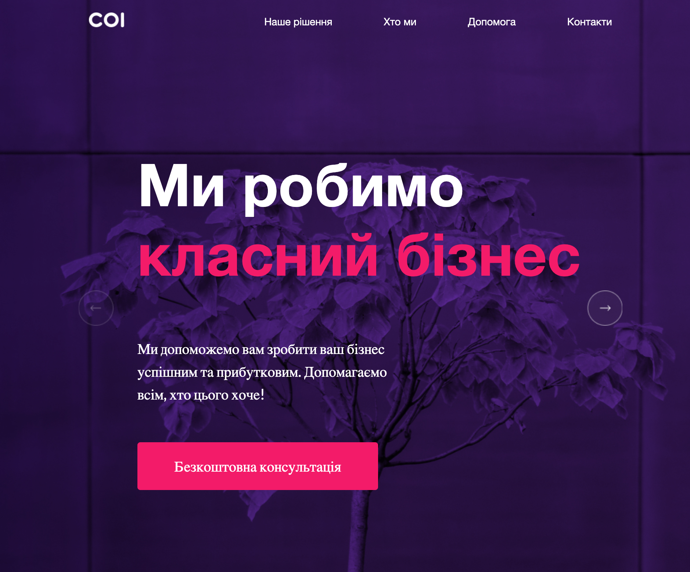

# Coi
This project build at the basic structure of HTML in web design. You can see the solutions in working with blocks, responsive design, crossbrowser compatible. 
Live demo [_here_](https://yuliyaadamiv.github.io/Coi/dist/). 

## Table of Contents

- [Coi](#coi)
  - [Table of Contents](#table-of-contents)
  - [General Information](#general-information)
  - [Technologies Used](#technologies-used)
  - [Screenshots](#screenshots)
  - [Setup](#setup)
    - [To open](#to-open)
    - [To edit](#to-edit)
  - [Contact](#contact)

## General Information

- The project consists of gulpfile.js, index.html, scss files, images and javascript file.
- The purpose of your project was show work with gulp.

## Technologies Used

- HTML
- SCSS
- JavaScript

## Screenshots

## Setup

### To open

- Download/clone from the Github

### To edit

- `$ npm install`
- `$ gulp watch`

## Contact

Created by [@Yuliya_Adamiv](https://github.com/YuliyaAdamiv).
